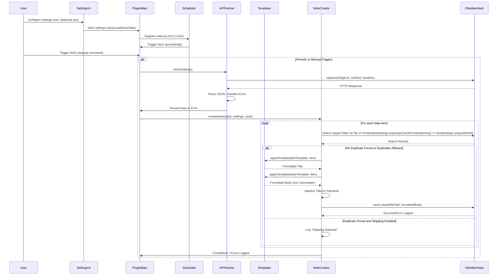

# Obsidian API Note Importer Plugin - Plan

## 1. Plugin Goal

To create an Obsidian plugin named "API Note Importer" (or similar) that periodically fetches data from a user-configured REST API endpoint and automatically creates notes in the user's vault based on templates applied to the fetched data.

## 2. Technology Stack

*   **Language:** TypeScript
*   **Environment:** Obsidian Plugin API
*   **HTTP Requests:** Obsidian's built-in `requestUrl` function.

## 3. Project Structure

A standard Obsidian plugin structure will be used:

```
.
├── main.ts           # Plugin entry point, lifecycle hooks, command registration, interval setup
├── settings.ts       # Settings interface definition and Settings Tab UI class
├── api.ts            # Logic for fetching and parsing data from the API
├── templating.ts     # Logic for applying title/body templates to data
├── noteCreator.ts    # Logic for checking duplicates and creating notes in the vault
├── manifest.json     # Plugin metadata (ID, name, version, etc.)
├── styles.css        # (Optional) CSS for styling the settings tab
└── tsconfig.json     # TypeScript configuration
└── package.json      # Node package dependencies (for development)
└── rollup.config.js  # Build configuration
```

## 4. Core Components & Logic

*   **Settings (`settings.ts`):**
    *   **Interface (`APINoteImporterSettings`):** Define the structure for storing settings:
        *   `apiUrl`: string
        *   `apiMethod`: 'GET' | 'POST' | ... (default 'GET')
        *   `apiHeaders`: Record<string, string> (e.g., `{ "Authorization": "Bearer YOUR_KEY" }`)
        *   `pollingIntervalMinutes`: number (min 5, default e.g., 60)
        *   `targetFolderPath`: string
        *   `noteTitleTemplate`: string (e.g., `{{id}} - {{summary}}`)
        *   `noteBodyTemplate`: string (e.g., `--- \n tag: api_import \n source_id: {{id}} \n --- \n # {{summary}} \n Details: {{details}}`)
        *   `uniqueIdField`: string (default 'id')
        *   `skipDuplicates`: boolean (default true)
        *   `duplicateCheckFrontmatterKey`: string (default 'source_id') **<-- Configurable**
    *   **Settings Tab (`APINoteImporterSettingTab`):**
        *   Provides UI elements (text inputs, dropdown, textareas, number input, toggle) for configuring all settings, including `duplicateCheckFrontmatterKey`.
        *   Input validation (e.g., ensure interval >= 5).
        *   Uses Obsidian's `addSetting()` helpers.
        *   Loads/saves settings using `plugin.loadData()` and `plugin.saveData()`.

*   **API Fetching (`api.ts`):**
    *   A function `fetchData(settings: APINoteImporterSettings): Promise<any>`
    *   Uses `requestUrl` with URL, method, and headers from settings.
    *   Handles network errors, checks status codes, parses JSON, logs errors.

*   **Templating (`templating.ts`):**
    *   A function `applyTemplate(template: string, data: Record<string, any>): string`.
    *   Uses simple regex (`/\{\{([^}]+)\}\}/g`) for `{{key}}` replacement.

*   **Note Creation (`noteCreator.ts`):**
    *   A function `createNotesFromData(data: any, settings: APINoteImporterSettings, vault: Vault, fileManager: FileManager): Promise<void>`.
    *   Normalizes input `data` into an array.
    *   Iterates through each item.
    *   **Duplicate Check:**
        *   If `settings.skipDuplicates` is true:
            *   Extract value of `settings.uniqueIdField` from the item.
            *   Search target folder files.
            *   Parse frontmatter of each file.
            *   Check if frontmatter contains `settings.duplicateCheckFrontmatterKey` with a matching value.
            *   Skip if duplicate found.
    *   **Note Generation:**
        *   Apply title and body templates.
        *   Sanitize title for filename.
        *   Construct full file path.
        *   Use `vault.create()` to create the note.
        *   Log errors.

*   **Main Plugin Logic (`main.ts`):**
    *   **`onload()`:** Load settings (with defaults), register settings tab, register interval (min 5 mins), register manual trigger command.
    *   **`onunload()`:** Clear interval.
    *   **Main Fetch/Process Function (`fetchAndProcess`):** Coordinates `fetchData` and `createNotesFromData`, handles logging.

## 5. Data Flow Diagram



## 6. Implementation Steps

1.  **Setup:** Initialize a new Obsidian plugin project.
2.  **Manifest:** Define `manifest.json`.
3.  **Settings:** Implement updated `APINoteImporterSettings` and `APINoteImporterSettingTab` (add new field).
4.  **Basic Plugin:** Implement `main.ts` with `onload`, `onunload`, settings loading/saving, command registration.
5.  **API Fetching:** Implement `fetchData` in `api.ts`.
6.  **Templating:** Implement `applyTemplate` in `templating.ts`.
7.  **Note Creation Core:** Implement `createNotesFromData` using the configurable `duplicateCheckFrontmatterKey`.
8.  **Duplicate Check:** Add the frontmatter-based duplicate checking logic.
9.  **Integration:** Wire up components in `main.ts`.
10. **Error Handling & Logging:** Add comprehensive `try...catch` and logging.
11. **Testing:** Test thoroughly with various scenarios.
12. **Documentation:** Create a `README.md`.

## 7. Next Steps

This plan will be used to guide the implementation in Code mode.